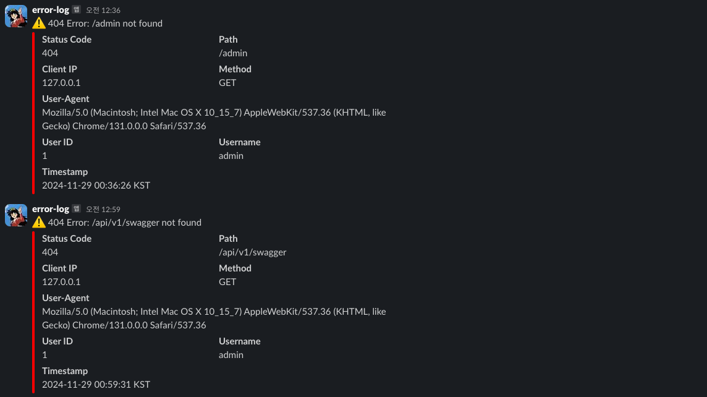

# Django Middleware를 활용한 에러 알림 구현

## AS-IS
- **문제 상황 인지**
  - Django 프로젝트에서 발생하는 에러를 실시간으로 파악하지 못해 대응 속도가 느림.
- **해결하려고 하는 문제**
  - 에러를 실시간으로 감지하고 팀에 알림을 보내는 방법이 필요함.
- **만들고 싶은 기능**
  - 에러 발생 시 DB에 로그를 기록하고, Slack으로 알림을 전송하는 시스템.

## Challenge
- **문제 해결을 위해 고민한 내용**
  - Django 에러를 효과적으로 감지하기 위해 적합한 구조를 선택해야 했음.
  - Slack Webhook API를 활용하여 알림을 전송하는 효율적인 방법 구현.
- **어떻게 기술적으로 해결했는지**
  - Django의 `Middleware`와 `process_exception` 메서드를 활용해 에러를 감지.
  - Python의 `logging` 모듈로 에러를 DB에 기록.
  - Slack Webhook API를 통해 에러 정보를 팀에게 알림.

### 구현된 코드 예제
```python
def send_slack_notification(self, request, response):
        """Slack 웹훅을 통해 에러 알림 전송"""
        webhook_url = os.getenv("WEBHOOK_URL")  # 슬랙 웹훅 URL
        client_ip = self.get_client_ip(request)
        method = request.method
        user_agent = request.META.get('HTTP_USER_AGENT', 'unknown')
        timestamp = localtime().strftime('%Y-%m-%d %H:%M:%S %Z')  # 지역 시간

        # 사용자 정보
        user_id = getattr(request.user, 'id', 'Anonymous')  # 로그인된 경우 ID
        username = getattr(request.user, 'username', 'Anonymous')  # 로그인된 경우 Username

        # 메시지 템플릿
        error_messages = {
            404: "404 Error: {path} not found",
            403: "403 Error: Forbidden access to {path}",
            500: "500 Error: Server error at {path}",
            400: "400 Error: Bad request at {path}",
        }
        error_message = error_messages.get(response.status_code, "Unknown Error").format(path=request.path)

        # Slack 메시지 페이로드
        payload = {
            "text": f"⚠️ {error_message}",
            "attachments": [
                {
                    "color": "#ff0000",  # 빨간색 표시
                    "fields": [
                        {"title": "Status Code", "value": response.status_code, "short": True},
                        {"title": "Path", "value": request.path, "short": True},
                        {"title": "Client IP", "value": client_ip, "short": True},
                        {"title": "Method", "value": method, "short": True},
                        {"title": "User-Agent", "value": user_agent, "short": False},
                        {"title": "User ID", "value": user_id, "short": True},
                        {"title": "Username", "value": username, "short": True},
                        {"title": "Timestamp", "value": timestamp, "short": False},
                    ],
                }
            ],
        }

        # Slack 웹훅 호출
        try:
            response = requests.post(webhook_url, json=payload)
            response.raise_for_status()
        except requests.exceptions.RequestException as e:
            logging.getLogger('django').error(f"Slack webhook failed: {e}")

    def get_client_ip(self, request):
        """요청에서 클라이언트 IP를 추출합니다."""
        x_forwarded_for = request.META.get('HTTP_X_FORWARDED_FOR')
        if x_forwarded_for:
            return x_forwarded_for.split(',')[0]
        return request.META.get('REMOTE_ADDR')
```

## TO-BE
- **아웃풋(결과)**
  - **에러 감지 및 알림 자동화**: 에러 발생 시, DB에 로그를 기록하고 Slack 채널에 알림 전송.
  - **효율적인 협업**: 팀원이 Slack 알림을 통해 문제를 즉시 파악하고 대응 가능.
  - **확장 가능성**: Slack 외의 알림 서비스(Firebase, Email 등)로 확장 가능.

### 이미지



---

**활용한 기술**
- Django Middleware
- Python `logging` 모듈
- Slack Webhook API

